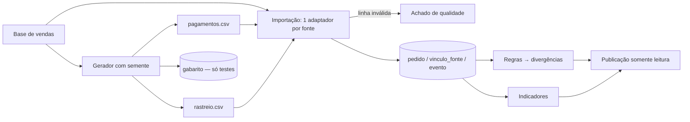
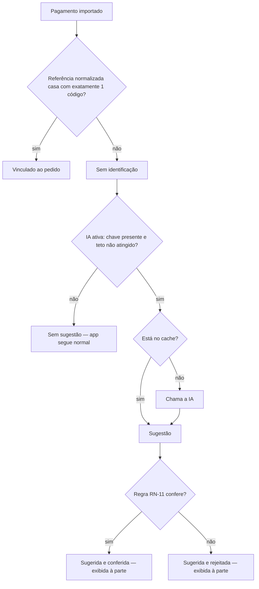

# POC_Lab — PRD Técnico

> Status: aprovado pelo usuário (Loop A fechado na rodada 2, 2026-10-07). Base: `PRD.md`. Nenhuma decisão de arquitetura é tomada aqui. As escolhas de "como" ficam para o Coordenador, no SDD.

Prioridade de cada requisito: **M** = Must, **S** = Should, **C** = Could (ver `PRD.md` §5).

## 1. Requisitos Funcionais

Os critérios de aceite estão no formato EARS.

**RF-01 Geração das fontes sintéticas (M)**
- Quando o gerador for executado, o sistema deve produzir `pagamentos.csv` e `rastreio.csv` a partir dos pedidos da base de vendas, cada um com códigos próprios da sua fonte.
- Quando o gerador for executado duas vezes com a mesma semente, o sistema deve produzir arquivos idênticos byte a byte.
- O sistema deve injetar ao menos um caso de cada problema plantado (RN-03 a RN-06, RN-08 e RN-09) e gravar um gabarito separado com pedido e tipo de cada caso.

**RF-02 Importação idempotente (M)**
- Quando o comando de importação for executado, o sistema deve ler as 3 fontes, cada uma por um adaptador próprio, e gravar pedidos, vínculos e eventos no modelo comum.
- Quando a importação for executada duas vezes sobre os mesmos arquivos, o sistema deve terminar com as mesmas contagens de pedidos, vínculos e eventos e com o mesmo estado derivado.
- Se uma linha de origem for inválida, então o sistema deve registrá-la como achado de qualidade e continuar a importação.
- Quando a importação terminar, o sistema deve exibir, por fonte, quantas linhas foram lidas, novas, já existentes e rejeitadas.

**RF-03 Identidade e vínculo (M)**
- O sistema deve atribuir a cada pedido uma identidade própria, diferente do código de qualquer fonte, e garantir um único vínculo por par (fonte, código externo).
- Quando um registro referenciar um código externo já vinculado, o sistema deve associá-lo ao pedido existente.
- Se a referência de um pagamento não casar deterministicamente (RN-09), então o sistema deve marcá-lo como "sem identificação" e não vinculá-lo.

**RF-04 Relatório de qualidade (M)**
- Quando o relatório for aberto, o sistema deve mostrar, para cada tipo de achado:
  - a contagem;
  - a regra que define o achado;
  - até 10 exemplos.
- Os tipos de achado são:
  - datas por formato;
  - pedidos sem envio;
  - valores fora do padrão (RN-10);
  - linhas rejeitadas;
  - registros repetidos;
  - pagamentos sem identificação;
  - eventos recebidos fora de ordem.
- As contagens da base de vendas devem bater com os números verificados: 830 datas no formato curto e 15.452 no longo; 21 pedidos sem data de envio.

**RF-05 Linha do tempo do pedido (M)**
- Quando o usuário buscar um código, o sistema deve mostrar os eventos do pedido ordenados pelo momento do fato (RN-07), com a fonte de cada evento e o número de fontes em que o pedido aparece.
- Os códigos aceitos na busca são a identidade própria do pedido ou o código de qualquer fonte.
- Quando os eventos tiverem chegado fora de ordem, o sistema deve exibir a mesma sequência que exibiria se tivessem chegado em ordem.
- Se o código não existir, então o sistema deve informar "pedido não encontrado" sem erro técnico.

**RF-06 Estado em uma data (S)**
- Quando o usuário informar um pedido e uma data, o sistema deve mostrar o estado derivado apenas dos eventos com momento do fato menor ou igual a essa data.

**RF-07 Lista de divergências (M)**
- O sistema deve listar cada pedido com divergência, com:
  - o tipo: duplicado, parcial, pago e não enviado, enviado e não pago ou entrega atrasada (RN-03 a RN-06);
  - o motivo em linguagem simples;
  - os eventos que sustentam a divergência.
- A lista deve poder ser filtrada por tipo.
- Quando comparada ao gabarito do RF-01, a lista deve conter 100% dos casos de divergência plantados e nenhum falso positivo nos pedidos do gabarito.
- Os casos de fora de ordem e de referência ambígua não entram na lista. Eles são conferidos no RF-04 e no RF-03.

**RF-08 Painel de indicadores (M/S)**

Cada indicador deve exibir a fórmula, o numerador e o denominador.
- (M) Percentual de entregas no prazo, por transportadora e mês (RN-06).
- (M) Quantidade de divergências por tipo.
- (S) Tempo médio pedido→envio e envio→entrega.
- (S) Valor pago contra valor devido, total e por situação.

**RF-09 Contrato de evento versionado (S)**
- O sistema deve gravar a versão do schema em cada evento.
- Quando eventos v1 e v2 coexistirem, um consumidor escrito para a v1 deve continuar funcionando sem alteração.
- Quais campos mudam na v2 é decisão do Coordenador.

**RF-10 Sugestão por IA para pagamento sem identificação (C)**
- Quando um pagamento estiver "sem identificação", houver chave configurada e o teto de chamadas não tiver sido atingido, o sistema deve pedir à IA uma sugestão de pedido.
- Uma regra determinística deve conferir a sugestão (RN-11).
- Quando o mesmo texto e os mesmos candidatos já tiverem sido consultados, o sistema deve usar o cache e não chamar a IA.
- Se não houver chave, ou se o teto tiver sido atingido, então o sistema deve marcar o pagamento como "sem sugestão" e funcionar normalmente.
- O sistema não deve chamar a IA a partir de requisições de visitantes do link público.

**RF-11 Publicação (M)**
- O sistema deve ficar acessível por um link público, somente leitura e sem login.
- O link deve oferecer as telas dos RF-04, RF-05, RF-07 e RF-08, e do RF-06 se ele entrar.

**RF-12 Rastreabilidade de decisões (M)**

O README, em português, deve conter:
- o que é a POC;
- como rodar em no máximo 3 comandos;
- um mapa das decisões;
- o que ficou de fora de propósito, com o motivo.

Cada registro de decisão deve ter:
- contexto;
- alternativas consideradas;
- decisão e motivo;
- consequências;
- o que deliberadamente não foi feito.

Lista mínima de decisões a registrar:
1. Escopo e ordem de corte (negócio).
2. Identidade própria do pedido contra uso do código do sistema de vendas.
3. Eventos imutáveis e estado derivado contra estado editável.
4. Idempotência por vínculo único.
5. Um adaptador por fonte contra abstração genérica ("quando não abstrair").
6. Versionamento do contrato de evento.
7. Onde processar e onde publicar, dentro dos limites do plano gratuito.
8. Um único serviço contra serviços separados.
9. Dados sintéticos com semente e gabarito.
10. IA como sugestão conferida por regra e opcional. Se for cortada, registrar o porquê.
11. Itens Should ou Could que não entraram no prazo de 1 dia, cada um com o motivo.

**RF-13 CI (M)**
- Quando houver push ou pull request, o CI deve rodar lint, checagem de tipos e testes.
- Se algum desses passos falhar, então o CI deve marcar a execução como falha.

## 2. Requisitos Não-Funcionais

- **RNF-01 Custo adicional zero.** Decisão do usuário em 2026-10-07, ao reabrir o Loop B: usar o plano pago do Cloudflare (Workers Paid) que ele já tem. Nenhum gasto novo além dele; nenhum outro serviço pago. Os limites do plano gratuito abaixo ficam só como histórico da decisão anterior (ADR 007), e os do plano pago devem ser confirmados no SDD:
  - Workers: 100 mil requisições/dia e 10 ms de CPU por requisição;
  - D1: 500 MB por base, 5 milhões de linhas lidas/dia, 100 mil linhas escritas/dia e 50 consultas por invocação;
  - Static assets: 20 mil arquivos e 25 MiB por arquivo.
- **RNF-02 Um único serviço** em TypeScript/Node, com SQLite. Usar ou não o D1 é hipótese a ser decidida pelo Coordenador.
- **RNF-03 Idioma.** Interface, mensagens, documentação e nomes do domínio em português.
- **RNF-04 Nome.** Só "POC_Lab". Nenhum nome de empresa ou produto de terceiros, exceto ferramentas técnicas e a atribuição de licença da base (I-01).
- **RNF-05 Reprodutibilidade.** Mesma entrada e mesma semente produzem os mesmos dados, divergências e indicadores. O projeto roda localmente sem conta no Cloudflare e sem chave de IA (M6).
- **RNF-06 Segurança.** Nenhum segredo no repositório; a chave de IA vem só de variável de ambiente. Os dados são todos fictícios, então não há dado pessoal real e a LGPD não se aplica materialmente.
- **RNF-07 Desempenho.**
  - Importação completa local em até 5 minutos numa máquina de desenvolvimento comum.
  - Páginas públicas respondendo em até 2 s.
  - Nenhuma agregação sobre a base bruta dentro de uma requisição pública (consequência do limite de 10 ms de CPU).
- **RNF-08 Testabilidade.** Cada validação do Loop 0 tem um teste automatizado nomeado por ela. A IA é testável com um provedor falso, sem rede.

## 3. Regras de Negócio

| ID | Regra | Racional |
|---|---|---|
| RN-01 | Valor devido = Σ UnitPrice × Quantity × (1 − Discount) dos itens do pedido, arredondado a 2 casas só no final. O frete não entra | Fonte única de verdade é o sistema de vendas. Arredondar só no final evita erro acumulado |
| RN-02 | Pedido quitado: \|pago − devido\| ≤ R$ 0,01 | Tolerância de arredondamento, sem mascarar diferença real |
| RN-03 | **Pagamento duplicado:** duas ou mais transações distintas (códigos diferentes) com o valor integral, de modo que o pago ultrapassa o devido. Mesmo código de transação repetido é registro repetido (achado de qualidade, absorvido pela idempotência), não divergência | Separa "o cliente pagou duas vezes", problema de negócio, de "o arquivo veio repetido", problema de dado |
| RN-04 | **Parcelas:** duas ou mais transações que somam o devido (RN-02) não geram divergência. Se 0 < pago < devido, gera "pagamento parcial" | Parcelar é legítimo. Tratar como duplicidade seria falso positivo |
| RN-05 | **Pago e não enviado:** pedido quitado sem evento de envio até a data de corte. **Enviado e não pago:** evento de envio e nenhum pagamento vinculado | Os dois sentidos do descasamento entre financeiro e logística |
| RN-06 | **Entrega atrasada:** data de entrega no rastreio maior que a data limite do pedido. Indicador "no prazo" = entregas com data ≤ data limite ÷ entregas com data conhecida. Pedidos sem entrega ficam fora do denominador e são exibidos à parte | Prazo é compromisso com o cliente, então mede a entrega e não o envio. O denominador fica explícito |
| RN-07 | Ordenação pelo momento do fato, nunca pela chegada. Empate: venda < pagamento < coleta < transporte < entrega, depois o código do evento | O estado não pode depender da ordem de chegada. O desempate deixa o resultado determinístico |
| RN-08 | **Eventos fora de ordem:** recebidos em ordem diferente da do fato. São achado de qualidade (RF-04), não divergência do pedido. A linha do tempo os corrige | O pedido não tem problema, quem tem é o dado. Separar evita inflar as divergências |
| RN-09 | Vínculo de pagamento só por referência que, após normalização (remover prefixo, espaços e zeros à esquerda), case com exatamente um código conhecido. Texto livre ou casamento com mais de um candidato vira "sem identificação" | Vincular por palpite contaminaria todos os indicadores financeiros |
| RN-10 | **Valor fora do padrão:** preço ou quantidade ≤ 0; desconto fora de [0, 1]; pagamento ≤ 0; pagamento maior que 2× o devido | Regras explícitas e auditáveis, em vez de outliers estatísticos difíceis de explicar |
| RN-11 | Sugestão da IA só é "conferida" se o valor for compatível com o saldo em aberto do pedido (RN-02), a data do pagamento for maior ou igual à do pedido e o pedido não estiver quitado. Sugestões, conferidas ou não, nunca entram nos indicadores oficiais e são exibidas à parte | A IA não é fonte de verdade. A regra é o critério e o humano decide |
| RN-12 | Eventos são imutáveis. Correção é um novo evento ou uma nova importação, nunca uma edição | Permite auditoria (RF-06) e reconstrução do estado |
| RN-13 | O gabarito de RF-01 é lido só pelos testes, nunca pelo app ou pelas regras | Regras escritas para "acertar o gabarito" seriam autoengano e invalidariam M1 |
| RN-14 | Data de corte (RN-05) = maior momento de fato existente na base | A base é histórica. Usar a data de hoje marcaria todo pedido sem envio como atrasado |

## 4. Fluxos de Usuário/Processo

**Preparação, feita localmente pelo autor:**

**Vínculo de um pagamento (RN-09, RN-11):**

**Jornada do avaliador:** README → mapa de decisões e "fora de propósito" → link publicado (divergências → linha do tempo de um pedido → indicadores → qualidade) → código e testes → CI verde. Caminho alternativo: o link está fora do ar, então o avaliador roda localmente em até 3 comandos (RNF-05).

## 5. Dependências e Integrações

**Entre requisitos:**
- RF-01 → RF-02 → RF-03 → {RF-04, RF-05, RF-07, RF-08}.
- RF-06 depende de RF-05.
- RF-09 depende de RF-02.
- RF-10 depende de RF-03.
- RF-11 depende de RF-04, RF-05, RF-07 e RF-08.
- RF-12 e RF-13 atravessam todos os demais.

**Integrações externas:**

| Integração | Uso | Observação |
|---|---|---|
| Repositório público da base de vendas (origem no aviso de licença) | Fonte de vendas, somente leitura | Licença MIT (§6). Baixada uma vez e não consultada em tempo de execução |
| Cloudflare (Workers, static assets, D1) | Publicação e API de leitura | Plano pago que o usuário já tem (RNF-01) |
| OpenAI API | RF-10 (C), opcional. O app funciona sem a chave | Créditos limitados. Cache, teto de chamadas e provedor falso nos testes |
| GitHub Actions | CI (RF-13) | Gratuito em repositório público (P-04) |
| Projeto de referência do autor | Padrões: monorepo pnpm, Vitest, ESLint, Playwright, wrangler static assets, porta de IA com provedor falso | Referência de padrões, não dependência de execução. NestJS, Postgres e VM não entram |

## 6. Premissas e Riscos Resolvidos

| Herdado | Situação | Evidência |
|---|---|---|
| P-02 (uso da base) | **Validada.** A licença é MIT. A atribuição (aviso de copyright) precisa ser mantida no repositório | Página do repositório no GitHub, consultada em 2026-10-07 |
| Contagens da base (16.282 pedidos, 609.283 itens, 21 sem envio, 830/15.452 por formato de data) | **Aceitas, a reconfirmar.** Vêm do documento original do Loop 0 e não foram reexecutadas aqui. O RF-04 transforma isso em teste automatizado | `PLANO-COMERCIAL.md`, "Dados verificados da base" |
| Limites do plano gratuito comportam a publicação | **Parcialmente validada.** Leitura cabe com folga. Já gravar a base bruta na D1 (cerca de 609 mil itens contra 100 mil escritas/dia) e agregar por requisição (10 ms de CPU) não cabem. Isso reforça a hipótese de processar localmente e publicar só o resultado. Decisão do Coordenador | Documentação oficial do Cloudflare (limites de Workers e D1), consultada em 2026-10-07 |
| P-01 (prazo) | **Resolvida.** O prazo é hoje, 2026-10-07. Primeiro os Must; depois os Should e o Could (IA), enquanto houver tempo, na ordem do `PRD.md` §5 | Resposta do usuário, rodada 2 |
| P-03 (decisão rastreável vale mais que funcionalidades) | **Confirmada** | Resposta do usuário, rodada 2 |
| P-04 (repositório público) | **Validada.** O GitHub Actions roda sem custo | Resposta do usuário, rodada 2 |
| P-05 (citação da base) | **Confirmada** (ver I-01) | Resposta do usuário, rodada 2 |

## 7. Interpretações Registradas

| ID | Ambiguidade | Interpretação escolhida | Por quê |
|---|---|---|---|
| I-01 | Pela restrição de nomes, nenhum nome de terceiros aparece. Mas a licença MIT exige atribuição da base | A base é citada só no aviso de licença e na documentação de origem dos dados, como dependência técnica. A interface e o domínio usam "sistema de vendas". **Confirmada pelo usuário na rodada 2** | Cumprir a licença é obrigatório. Restringir a citação ao mínimo atende à intenção da restrição |
| I-02 | "No prazo" (PRD Q1) | Entrega ≤ data limite. Pedidos sem entrega ficam fora do denominador (RN-06) | O prazo é com o cliente, e o denominador fica explícito |
| I-03 | Duplicado, parcela ou repetido (Q2) | Três conceitos distintos (RN-03, RN-04) | Evita falso positivo e separa problema de negócio de problema de dado |
| I-04 | Empate na ordenação (Q3) | Ordem canônica por tipo e depois código do evento (RN-07) | Determinismo |
| I-05 | "Valor fora do padrão" (Q4) | Regras explícitas (RN-10), sem estatística | Auditável e explicável na entrevista |
| I-06 | Data de corte (Q5) | Maior momento de fato na base (RN-14) | A base é histórica |
| I-07 | Código aceito na busca (Q6) | Identidade própria ou código de qualquer fonte (RF-05) | O analista chega com o código do sistema que tem na mão. Isso materializa M2 |
| I-08 | Lista mínima de decisões (Q7) | As 11 listadas no RF-12 | Cobre negócio e arquitetura sem virar documentação de tudo |
| I-09 | Eventos fora de ordem são divergência? | Não. São achado de qualidade (RN-08) | O problema é do dado, não do pedido |
| I-10 | Frete entra no valor devido? | Não (RN-01) | O Loop 0 define o valor do pedido só pelos itens |
| I-11 | "Tudo em português" inclui o código? | Nomes do domínio, mensagens, documentação e commits em português. Palavras-chave da linguagem e APIs de bibliotecas ficam como são. O detalhe vai para o `GUARDRAILS.md` | Inglês é inevitável na linguagem. O domínio em português mantém a linguagem ubíqua com o negócio |
