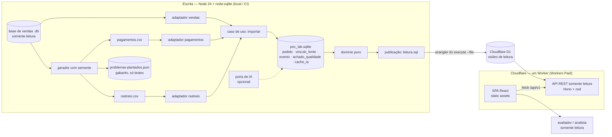

# POC_Lab — SDD (Software Design Document)

> Status: rascunho, Loop B rodada 2 — reabertura (2026-10-07). Base: `PRD-TECNICO.md` (aprovado; RNF-01 alterado na reabertura), `PRD.md`, `CTO-REVIEW.md`.
> Mudança desta rodada: o usuário tem o **Workers Paid** e pediu publicação no **D1** com uma **API REST somente leitura** no Worker, no lugar dos JSON estáticos. ADR-007, 011 e 012 foram substituídos por ADR-013, 014 e 015; o contrato da API está no ADR-016.
> Princípio que governa todas as escolhas: **o caminho mais simples que demonstre bem Clean Code e System Design, implementável hoje** (R-G1-02, R-G1-04). Cada decisão relevante tem ADR em `.md/adr/` com alternativas e o que ficou de fora.

## 1. Visão Geral da Arquitetura

A POC_Lab é **um único serviço em TypeScript**, separado em dois lados que nunca se misturam:

1. **Escrita (processamento local ou no CI, Node 24 + SQLite).** Um comando Node gera as fontes sintéticas, importa as 3 fontes para um *event store* em SQLite (`pedido`, `vinculo_fonte`, `evento`, `achado_qualidade`), aplica as regras de domínio e **materializa as visões de leitura** num arquivo SQL determinístico. A ingestão nunca roda na nuvem.
2. **Leitura (Cloudflare, Workers Paid).** O arquivo SQL é carregado no **D1**. Um **Worker** em TypeScript (Hono) expõe uma **API REST somente leitura** (`/api/v1`, `/api/v2`) e serve o **site Vite + React** como static assets. O site consome a API.

Padrão: **monólito modular com núcleo de domínio puro** (hexagonal leve) + **CQRS no sentido mínimo**: o modelo de escrita é o log de eventos local; o de leitura é o D1, uma projeção descartável recriada a cada publicação. O domínio e o contrato são escritos uma vez e rodam nos três lugares: processamento (regras, projeções), Worker (normalização de código, forma v1/v2 dos eventos) e navegador (estado em uma data, RF-06; e, como única outra exceção, a marcação de quais pagamentos são os duplicados dentro de um pedido que o processamento já declarou `duplicado`, ADR-019).

Em relação à preferência "SQLite + Node no backend": o Node e o `node:sqlite` ficam no processamento; na nuvem o banco também é SQLite (D1), mas só com o resultado. O Worker não é um Node completo e não precisa ser: só lê.



## 2. Componentes e Fluxo de Dados

Repositório em **pnpm workspace com 3 pacotes**: `nucleo`, `processamento` e `web` (ADR-008 em parte substituído pelo ADR-018). O Worker fica no pacote `web` porque site e API são publicados juntos.

| Pacote / módulo | Responsabilidade | Depende de |
|---|---|---|
| `nucleo/src/dominio/` | Tipos do modelo comum e regras puras: RN-01 a RN-14 (valor devido, quitação, ordenação canônica, derivação de estado, divergências, achados, indicadores, conferência RN-11). **Sem I/O, sem `node:*`, sem zod** — roda no Node, no Worker e no navegador | nada |
| `nucleo/src/contrato/` | **Contrato da API** (ADR-016): esquemas zod de parâmetros e respostas (v1 e v2 da linha do tempo), formato de erro RFC 9457, paginação, normalização do código buscado. Sem `node:*` | `dominio`, `zod` |
| `processamento/src/fontes/vendas.ts` | Adaptador da base de vendas (lê o `.db` somente leitura, normaliza os 2 formatos de data, calcula valor devido RN-01, produz vínculos, eventos `venda` e achados) | `dominio` |
| `processamento/src/fontes/pagamentos.ts` | Adaptador de `pagamentos.csv` (normaliza referência RN-09, valida RN-10, detecta registro repetido no arquivo) | `dominio` |
| `processamento/src/fontes/rastreio.ts` | Adaptador de `rastreio.csv` (eventos `coleta`, `transporte`, `entrega`; guarda a ordem de chegada) | `dominio` |
| `processamento/src/armazenamento/` | Event store local: repositório `node:sqlite`, `schema.sql`, inserções idempotentes (`ON CONFLICT DO NOTHING`) | `dominio` |
| `processamento/src/importacao/` | Caso de uso `importar`: chama os 3 adaptadores **explicitamente**, grava, devolve contagens por fonte (lidas, novas, já existentes, rejeitadas) | `fontes`, `armazenamento` |
| `processamento/src/publicacao/` | Lê o event store, aplica o domínio e escreve `dados/publicacao/leitura.sql` (DDL do D1 + `INSERT` em lotes); contém `leitura-d1.sql` (schema do D1) | `dominio`, `contrato`, `armazenamento` |
| `processamento/src/gerador/` | Gera `pagamentos.csv`, `rastreio.csv` e `problemas-plantados.json` (o gabarito) com PRNG com semente (mulberry32, sem biblioteca) | `fontes/vendas` (leitura) |
| `processamento/src/ia/` | Porta `ProvedorSugestao`, provedor falso (testes), provedor OpenAI via `fetch`, cache e teto (RF-10, Could). Só local | `dominio`, `armazenamento` |
| `processamento/src/cli/` | `baixar-base`, `gerar`, `importar`, `sugerir`, `publicar-dados` (escreve o SQL e carrega o D1 local), `preparar` (encadeia tudo) | todos acima |
| `web/worker/` | **API de leitura** (Hono): rotas GET, validação de entrada por zod, consultas D1 parametrizadas, erros RFC 9457, cabeçalhos de segurança. Serve os static assets do site | `dominio`, `contrato`, binding `DB` (D1) |
| `web/src/` | SPA Vite + React: Divergências, Linha do tempo, Indicadores, Qualidade. Lê só a API (`/api/v1`) e valida as respostas com o mesmo contrato zod | `dominio`, `contrato` |

Regra de dependência (ESLint `no-restricted-imports` e dependências do `package.json`): `dominio` não importa nada; `contrato` só `dominio` e `zod`; `nucleo` não depende de nenhum outro pacote; `web/worker` e `web/src` dependem só de `nucleo` (nunca de `processamento`, nem `node:*` fora de `test/`); `processamento` depende de `nucleo`. `web/src` não importa `web/worker`; a direção de import dentro do `processamento` está na subseção abaixo; **nenhum código fora de `test/` lê o gabarito (`problemas-plantados.json`)** (RN-13).

**Fluxo de preparação** (`pnpm preparar`, determinístico, estimado em 1–2 min, RNF-07 ≤ 5 min):
1. `baixar-base`: baixa o `.db` de URL fixada em commit e confere SHA-256. Fica em `dados/origem/` (fora do git).
2. `gerar --semente 20261007`: escreve `dados/gerado/pagamentos.csv`, `rastreio.csv`, `problemas-plantados.json`.
3. `importar`: grava `dados/poc_lab.sqlite`; repetir é idempotente (RF-02).
4. `sugerir` (só se `OPENAI_API_KEY` existir; senão "sem sugestão" e segue).
5. `publicar-dados`: escreve `dados/publicacao/leitura.sql` e o carrega no D1 local (`wrangler d1 execute poc-lab --local --file`, sem conta).

**Publicação** (`pnpm publicar`, autor, com `wrangler login`): `preparar` → `vite build` → `wrangler d1 execute poc-lab --remote --file dados/publicacao/leitura.sql` → `wrangler deploy` (ADR-015). D1 primeiro, Worker depois.

**Configuração do Worker** (`web/wrangler.jsonc`): `main: worker/index.ts`; `assets` com `not_found_handling: "single-page-application"` e `run_worker_first: ["/api/*"]` (só `/api/*` invoca o Worker; o resto é asset, gratuito e sem CPU); `d1_databases` com binding `DB`; `compatibility_date` fixa. Sem segredos, sem outros bindings.

### Pacotes, pastas e fronteiras

Desenho do ADR-018.

**Pacotes e quem depende de quem**

| Pacote | Contém | Depende de | Nunca depende de |
|---|---|---|---|
| `nucleo` | `dominio/`, `contrato/` (código que roda no Node, no Worker e no navegador) | `zod` (só `contrato/`) | `processamento`, `web`, `node:*` |
| `processamento` | CLI, casos de uso, fontes, armazenamento, publicação, gerador, IA (Node + `node:sqlite`) | `nucleo` | `web` |
| `web` | Worker (`worker/`) e site (`src/`) | `nucleo` | `processamento`, `node:*` fora de `test/` |

Código usado por mais de uma aplicação mora em `nucleo`, nunca em `processamento` nem copiado no `web`.

**Camadas e direção de import (dentro do `processamento`)**: `cli` → `aplicacao` → `fontes` / `armazenamento` / `publicacao` / `ia` → `nucleo`. `gerador` lê `fontes/vendas`. Camada de baixo nunca importa camada de cima. `config/` (caminhos e constantes padrão) pode ser importada por `cli` e `aplicacao`. `aplicacao/` guarda os casos de uso (importar, publicar, sugerir) e passa a abrigar o que hoje está em `importacao/`.

**Módulo único de dados**
- Event store local: só `armazenamento/` acessa `node:sqlite`; os demais módulos chamam suas funções.
- D1 (leitura): só `web/worker/consultas.ts` executa SQL; as rotas chamam suas funções.

**Onde a regra de negócio roda**: no `nucleo/dominio` (RN-01 a RN-14), chamado pelo processamento (projeções e achados), pelo Worker (normalização de código e forma v1/v2) e, só para o estado em uma data, pelo navegador (RF-06). Adaptadores, CLI e rotas não têm regra de negócio própria.

**Árvore de pastas alvo**

```
nucleo/
  src/dominio/          regras puras RN-01 a RN-14
  src/contrato/         esquemas zod da API (ADR-016)
  test/
processamento/
  src/cli/              comandos
  src/aplicacao/        casos de uso: importar, publicar, sugerir
  src/config/           caminhos e constantes padrão
  src/fontes/           vendas, pagamentos, rastreio
  src/armazenamento/    único acesso a node:sqlite; schema.sql
  src/publicacao/       leitura.sql e leitura-d1.sql
  src/gerador/          fontes sintéticas e gabarito
  src/ia/               porta e provedores (opcional)
  test/
web/
  worker/               Hono; consultas.ts é o único acesso ao D1
  src/                  SPA React
  wrangler.jsonc
  test/
```

### API de leitura (ADR-016)

Somente GET/HEAD; respostas `application/json` (erros `application/problem+json`); entrada validada por zod; consultas por índice.

| Rota | Parâmetros | Resposta (resumo) | Tela |
|---|---|---|---|
| `GET /api/v1/resumo` | — | Totais, data de corte (RN-14), semente, versão do contrato, identificador da publicação | Cabeçalho |
| `GET /api/v1/divergencias` | `tipo?` (`duplicado`\|`parcial`\|`pago_nao_enviado`\|`enviado_nao_pago`\|`entrega_atrasada`), `pagina?` (≥ 1, padrão 1), `tamanho?` (1–100, padrão 50) | `{ dados: [{ pedido, tipo, motivo, eventos[] }], paginacao: { pagina, tamanho, total, totalPaginas } }` | T1 |
| `GET /api/v1/pedidos/{codigo}/linha-do-tempo` | `codigo` = `PED-nnnnnn` ou código de qualquer fonte (até 40 caracteres) | Pedido (identidade, fontes e códigos, valor devido, pago, data limite, divergências) + eventos em ordem canônica (RN-07) na **forma v1**, com marca "chegou fora de ordem"; 404 `pedido_nao_encontrado` | T2 |
| `GET /api/v2/pedidos/{codigo}/linha-do-tempo` | igual | Igual, com `versao_schema` em cada evento e os campos v2 (`meio_pagamento` em `pagamento` v2) | Demonstração RF-09 (README / `curl`) |
| `GET /api/v1/indicadores` | — | Cada indicador com fórmula, numerador, denominador e resultado; pedidos sem entrega à parte | T3 |
| `GET /api/v1/qualidade` | — | Por tipo de achado: contagem, regra, até 10 exemplos; sugestões da IA à parte | T4 |

Qualquer outra rota sob `/api/`: 404 `rota_nao_encontrada`; método diferente de GET/HEAD: 405 `metodo_nao_permitido`; parâmetro inválido: 400 `parametro_invalido` com a lista de erros; falha inesperada (inclusive D1 indisponível): 500 `erro_interno`, sem detalhe técnico.

## 3. Stack Tecnológica

Coluna "Mudou?" em relação à versão aprovada antes (ADR-011 → ADR-014).

| Camada | Escolha | Mudou? | Justificativa | Alternativa descartada (por quê) |
|---|---|---|---|---|
| Runtime do processamento | **Node 24 LTS** + TypeScript 5 (`strict`), ESM, type stripping nativo (`erasableSyntaxOnly`) | Não | Preferência do usuário; LTS; sem etapa de build nos comandos | Bun/Deno (sem ganho); `tsx` fica como plano B |
| Banco de escrita | **SQLite via `node:sqlite`** (event store local) | Não | É SQLite, como pedido; sem binário nativo no Windows nem no CI | `better-sqlite3` (plano B); ingestão no D1 (proibido: ingestão nunca na nuvem) |
| Banco de leitura | **Cloudflare D1** com as visões de leitura (~150 mil linhas) | **Sim** (antes: JSON estáticos) | Pedido do usuário; cabe com folga no plano pago (ver limites abaixo); é SQLite, mesmo dialeto do teste local | JSON estáticos (ADR-007, substituído); D1 com a base bruta (desnecessário, ADR-013) |
| API | **Worker em TypeScript com Hono 4** | **Sim** (antes: sem script) | Padrão de fato no Workers; roteamento, 404/405 e erro central em poucas linhas; testável com `app.request()` | Roteamento manual (reimplementa o que o Hono já dá); itty-router (menos idiomático hoje) |
| Contrato | **zod 4** + `@hono/zod-validator`, em `nucleo/src/contrato/` | **Sim** (novo) | Um esquema valida a entrada no Worker, gera os tipos e valida a resposta no site | Validação manual (duplica tipos); JSON Schema + Ajv (mais peças) |
| Erros | **RFC 9457** (`application/problem+json`) + `codigo` estável | **Sim** (novo) | Padrão conhecido | Formato próprio |
| Leitura de CSV | `csv-parse` / `csv-stringify` (síncrono) | Não | CSV com texto livre exige parser correto | `split(',')` |
| Datas | Funções próprias sobre ISO-8601 UTC | Não | 2 formatos conhecidos | Bibliotecas de datas |
| Frontend | **Vite + React 19 + React Router**, CSS puro com tokens; cliente HTTP próprio (`fetch` + zod + `AbortController`) | **Sim, parcial** (lê API, não JSON) | 4 telas de leitura; sem estado global | TanStack Query (cache e *retry* que 4 telas não precisam); Tailwind, biblioteca de componentes e de gráficos |
| Dev local site + API | **`@cloudflare/vite-plugin`** + `wrangler` (D1 local, sem conta) | **Sim** (novo) | `pnpm dev` sobe tudo num processo; caminho oficial SPA + Worker | `vite build` + `wrangler dev` (plano B); 2 processos com *proxy* |
| Testes | **Vitest** nos 2 pacotes; Worker testado com `app.request()` + D1 de teste sobre `node:sqlite`; **Testing Library + vitest-axe** no site | **Sim, parcial** (testes da API) | Mesmo executor; SQL testado é o mesmo do D1 | `@cloudflare/vitest-pool-workers` (configuração extra); Playwright E2E (prazo) |
| Qualidade | ESLint 9 (flat) + typescript-eslint (`strictTypeChecked`), `tsc --noEmit` | Não (regras de fronteira ampliadas) | `no-restricted-imports` garante fronteiras e RN-13 | Prettier |
| Monorepo | pnpm workspace (`nucleo`, `processamento`, `web`) | **Sim** (antes: 2 pacotes; ADR-018) | Worker vai no `web` (mesma unidade de deploy); `nucleo` guarda só o que roda nos três lugares | Pacote `api` separado; pacote `shared` genérico; manter `dominio`/`contrato` em `processamento` |
| CI | GitHub Actions, `ubuntu-latest`, ações fixadas por SHA | Não | Gratuito em repo público; RF-13 | Deploy automático (ADR-015) |
| Hospedagem | **Um Worker** (Workers Paid): API em `/api/*` + site como static assets; `wrangler deploy` manual | **Sim** (antes: só assets) | Mesmo domínio, sem CORS; assets continuam gratuitos | Pages + Worker separado (2 deploys) |
| IA (Could) | OpenAI via `fetch` atrás de uma porta, só no processamento local | Não | Nunca chamada por visitante (RF-10); o Worker não tem chave nem binding de IA | SDK oficial; IA no Worker |

**Limites do plano pago confirmados na documentação oficial do Cloudflare em 2026-10-07** e o uso previsto:

| Recurso | Limite / incluído (Workers Paid) | Uso previsto da POC_Lab |
|---|---|---|
| Requisições ao Worker | Sem limite diário; 10 milhões/mês incluídas; excedente US$ 0,30/milhão | Avaliação: centenas a poucos milhares/mês. Requisições a assets não contam |
| CPU | 30 milhões de ms/mês incluídos; padrão 30 s por requisição (máx. 5 min) | ~1–5 ms por requisição (1–2 consultas por índice + JSON) |
| Memória | 128 MB por isolate | Respostas ≤ 100 itens |
| Static assets | 100 mil arquivos por versão; 25 MiB por arquivo; requisição servida só por asset não é cobrada | Dezenas de arquivos do build do Vite |
| D1 — tamanho | 10 GB por base (5 GB incluídos na conta) | Dezenas de MB |
| D1 — escritas | 50 milhões de linhas/mês incluídas; excedente US$ 1,00/milhão | ~200 mil linhas por publicação (com índices) → ~250 publicações/mês sem custo |
| D1 — leituras | 25 bilhões de linhas varridas/mês incluídas | Consultas por índice; pior caso (contagem de divergências "Todos") alguns milhares de linhas por requisição |
| D1 — por invocação | 1.000 consultas; 100 parâmetros por consulta; 100 KB por instrução; 2 MB por linha; 30 s por consulta | 1–2 consultas; `INSERT` gerados em lotes ≤ 100 KB |
| D1 — importação | `d1 execute --file` até 5 GB | `leitura.sql` estimado em dezenas de MB |

Histórico: no plano gratuito (ADR-007), Workers tinha 100 mil requisições/dia e 10 ms de CPU, e D1 100 mil linhas escritas/dia — uma publicação de ~150 mil linhas não caberia num dia. Por isso a decisão anterior foi estática.

## 4. Decisões Arquiteturais (índice de ADRs)

Os itens 1 a 10 do RF-12 estão cobertos; o item 11 (Should/Could cortados) vai para o README ao fim do dia.

| ADR | Título | Status | RF-12 item |
|---|---|---|---|
| [001](adr/001-escopo-e-ordem-de-corte.md) | Escopo e ordem de corte | Aceito | 1 |
| [002](adr/002-identidade-propria-do-pedido.md) | Identidade própria do pedido | Aceito | 2 |
| [003](adr/003-eventos-imutaveis-e-estado-derivado.md) | Eventos imutáveis e estado derivado | Aceito | 3 |
| [004](adr/004-idempotencia-por-vinculo-unico.md) | Idempotência por vínculo e chave de evento únicos | Aceito | 4 |
| [005](adr/005-um-adaptador-por-fonte.md) | Um adaptador por fonte (quando não abstrair) | Aceito | 5 |
| [006](adr/006-versionamento-do-contrato-de-evento.md) | Versionamento aditivo do contrato de evento | Aceito | 6 |
| [007](adr/007-processar-local-publicar-estatico.md) | Processar localmente, publicar projeções estáticas | **Substituído pelo 013** | (histórico do 7) |
| [008](adr/008-um-unico-servico.md) | Um único serviço (monólito modular) | Aceito | 8 |
| [009](adr/009-dados-sinteticos-com-semente-e-gabarito.md) | Dados sintéticos com semente e gabarito | Aceito | 9 |
| [010](adr/010-ia-como-sugestao-opcional.md) | IA como sugestão opcional, conferida por regra | Aceito | 10 |
| [011](adr/011-stack-node-sqlite-react.md) | Stack: Node 24, `node:sqlite`, pnpm, Vite/React, Vitest | **Substituído pelo 014** | — |
| [012](adr/012-ci-e-publicacao.md) | CI no GitHub Actions e publicação manual | **Substituído pelo 015** | — |
| [013](adr/013-processar-local-publicar-no-d1-com-api-de-leitura.md) | Processar localmente, publicar no D1 e servir por API de leitura no Worker | Aceito | 7 |
| [014](adr/014-stack-node-sqlite-d1-worker-hono-react.md) | Stack: Node/`node:sqlite`; Worker com Hono e zod sobre D1; Vite/React | Aceito | — |
| [015](adr/015-ci-e-publicacao-d1-worker.md) | CI no GitHub Actions e publicação manual de D1 + Worker | Aceito | — |
| [016](adr/016-contrato-da-api-de-leitura.md) | Contrato da API: rotas, validação, erros RFC 9457, paginação e versão | Aceito | 6 (demonstração na API) |
| [017](adr/017-convergencia-de-identidade-de-pedido.md) | Convergência de identidade de pedido pelo código bruto de vendas (complementa ADR-002 e ADR-004) | Aceito | 2, 3 |
| [018](adr/018-pacote-nucleo-dominio-e-contrato.md) | Pacote `nucleo` com `dominio` e `contrato` (substitui em parte o ADR-008) | Aceito | 8 |
| [019](adr/019-marcacao-de-pagamento-duplicado-no-navegador.md) | Marcação de pagamento duplicado (RN-03) no navegador, ao lado do estado em uma data (complementa ADR-013 e ADR-016) | Aceito | 3 |

## 5. Modelo de Dados de Alto Nível

**Event store local** (`processamento/src/armazenamento/schema.sql`) — sem mudança:

| Tabela | Colunas principais | Restrições / observações |
|---|---|---|
| `pedido` | `id_pedido` (`PED-000001`…) | Identidade própria, sequencial na ordem determinística de importação (ADR-002) |
| `vinculo_fonte` | `fonte` (`vendas`/`pagamentos`/`rastreio`), `codigo_externo`, `id_pedido` | `UNIQUE(fonte, codigo_externo)` — base da idempotência (ADR-004) |
| `evento` | `fonte`, `codigo_evento`, `id_pedido` (nulo = pagamento sem identificação), `tipo`, `momento_fato` (ISO-8601 UTC), `ordem_chegada`, `versao_schema`, `dados` (JSON) | `UNIQUE(fonte, codigo_evento)`; só `INSERT` (RN-12) |
| `achado_qualidade` | `tipo`, `fonte`, `referencia`, `regra`, `detalhe` | `UNIQUE(tipo, fonte, referencia)` |
| `cache_ia` | `chave` (SHA-256 de texto + candidatos ordenados + modelo), `resposta`, `criado_em` | Só se RF-10 entrar |

**Visões de leitura no D1** (`processamento/src/publicacao/leitura-d1.sql`) — projeção recriada a cada publicação (`DROP`/`CREATE`), nunca fonte de verdade. Só o necessário: **os ~609 mil itens de venda não são publicados** (só o valor devido já calculado).

| Tabela | Colunas principais | Chave / índice | Linhas (estim.) |
|---|---|---|---|
| `pedido_resumo` | `id_pedido`, `valor_devido`, `valor_pago`, `data_limite`, `situacao_pagamento`, `fontes` (JSON: fonte → código) | PK `id_pedido` | 16.282 |
| `vinculo_codigo` | `codigo` (normalizado), `fonte`, `id_pedido` | PK `codigo` (os formatos por fonte não colidem; a publicação falha se colidirem) | ~49 mil |
| `linha_do_tempo` | `id_pedido`, `posicao` (ordem canônica RN-07), `codigo_evento`, `fonte`, `tipo`, `momento_fato`, `versao_schema`, `dados` (JSON), `fora_de_ordem` (0/1) | PK `(id_pedido, posicao)` | ~80 mil |
| `divergencia` | `tipo`, `id_pedido`, `motivo`, `eventos` (JSON: tipo, data, fonte, código) | PK `(tipo, id_pedido)`; índice `(id_pedido, tipo)` para "Todos" | milhares |
| `documento` | `chave` (`resumo`, `indicadores`, `qualidade`), `conteudo` (JSON já no formato do contrato) | PK `chave` | 3 |

Contrato do evento (`dominio/evento.ts`, união discriminada por `tipo` + `versao_schema`) — sem mudança:
- `venda` v1: `valor_devido`, `data_limite`, `transportadora`.
- `pagamento` v1: `valor`, `referencia_original`. **v2** (aditiva): + `meio_pagamento`. Consumidor v1 (saldo/quitação) ignora o campo novo (RF-09, ADR-006). Na API, `/api/v1` sempre devolve a forma v1; `/api/v2` devolve `versao_schema` e os campos v2 (ADR-016).
- `coleta` / `transporte` / `entrega` v1: `transportadora`, `codigo_rastreio`.

Derivados (calculados pelo domínio na publicação, gravados nas visões): estado do pedido, divergências, achados "fora de ordem", indicadores. "Envio" (RN-05) = evento `coleta`. "Pedidos sem envio" (RF-04) = sem data de envio na base de vendas (21). O "estado em uma data" (RF-06) não é gravado: o navegador calcula com o domínio sobre os eventos da API. Exceção (ADR-019): na tela T2 o navegador chama `detectarDuplicado` só para marcar quais pagamentos são os repetidos, e só em pedido que a API já listou com a divergência `duplicado`; não decide divergência. Se a T2 ganhar v2, a marcação passa para a API.

## 6. Riscos Técnicos

| Risco | Severidade | Mitigação |
|---|---|---|
| Prazo de 1 dia (R-G1-04), agora com Worker, D1 e contrato a mais | Alta | Must primeiro e publicado cedo; corte na ordem do PRD §5; `/api/v2` fica no lote Should do contrato v2; o que sair vira registro no README |
| **Custo por uso abusivo da API** (RNF-01): requisições ao Worker acima de 10 milhões/mês são cobradas; o link é público e sem autenticação | Média (impacto) / Baixa (probabilidade) | Só `/api/*` invoca o Worker (`run_worker_first`); páginas e arquivos do site continuam gratuitos; respostas pequenas e por índice (pouca CPU); o autor configura alerta de uso no painel do Cloudflare e pode tirar a API do ar com `wrangler delete` ou removendo a rota. Limite de taxa não ajuda aqui (a requisição barrada também é cobrada) |
| Diferença de comportamento entre o D1 e o `node:sqlite` dos testes | Baixa | SQL simples (SELECT por chave/índice, `COUNT`, `LIMIT/OFFSET`), sem extensão; o D1 é SQLite; conferência manual pós-publicação (`curl` nas 6 rotas) |
| Arquivo SQL grande ou instrução > 100 KB falhar na importação | Baixa | `INSERT` em lotes com teto de bytes por instrução; sem `BEGIN`/`COMMIT` (D1 não aceita no arquivo); teste do gerador do SQL verifica o teto |
| Janela de erro na API durante a republicação (tabelas recriadas) ou carga que falha no meio | Baixa | Publicar fora do horário de avaliação; o site mostra erro com "Tentar de novo"; bookmark do Time Travel guardado antes da carga e restore documentado (ver `### Troca de dados em produção`); troca azul/verde fica de fora |
| Plugin do Vite e `wrangler d1 execute --local` usarem pastas de estado diferentes (D1 local vazio no `pnpm dev`) | Baixa | Ambos usam `.wrangler/state` do pacote `web`; plano B `vite build` + `wrangler dev` |
| Carga do D1 local deixar `pnpm preparar` lento (RNF-07 ≤ 5 min) | Baixa | ~150 mil linhas em `INSERT` multi-linha; medir no primeiro uso; se passar, reduzir índices na carga |
| Latência do D1 (região única) somada à do Worker passar de 2 s (RNF-07) | Baixa | 1–2 consultas por índice por requisição; réplicas de leitura ficam de fora |
| Divergência "natural" colidir com caso plantado (M1) | Média | Plantio só em pedidos "limpos"; teste de M1 compara tipos por pedido do gabarito |
| `node:sqlite` ainda *release candidate* no Node 24 | Baixa | Isolado em `armazenamento/`; plano B `better-sqlite3` |
| Type stripping nativo rejeitar alguma sintaxe | Baixa | `erasableSyntaxOnly`; plano B `tsx` |
| URL da base de vendas sair do ar | Média | URL fixada + SHA-256; download manual no README; cache no CI |
| D1 publicado desatualizado em relação ao Worker publicado | Baixa | `pnpm publicar` sempre roda `preparar`, carrega o D1 e só então faz o deploy; `resumo` traz versão do contrato e identificador da publicação |

### Troca de dados em produção

Vale para o único fluxo que substitui dados publicados: `pnpm publicar` carrega `leitura.sql` no D1 remoto (`DROP`/`CREATE` + `INSERT`). Decisão do BK-0005, dentro do ADR-013 e do ADR-015 (nenhum ADR novo: não muda a decisão, só acrescenta um passo ao script).

- **Janela de inconsistência.** Existe: o arquivo é executado sem `BEGIN`/`COMMIT` (o D1 não aceita no arquivo), então, entre o `DROP` e o último `INSERT`, a API pode responder com tabelas vazias ou parciais. Duração esperada: segundos a poucos minutos (dezenas de MB). Aceita para a POC; publicar fora do horário de avaliação. O Worker antigo continua no ar durante a carga (D1 primeiro, Worker depois), e a API responde 500 `erro_interno` sem detalhe, nunca dado errado calculado.
- **Atomicidade.** Não há. Alternativa descartada: tabelas de staging com troca por renomeação. Motivo: dobra as escritas (~400 mil linhas por publicação, ~125 publicações/mês sem custo), exige que o `leitura-d1.sql` crie e renomeie tabelas e índices (muda a regra G-05 e o teste do gerador) e o ganho é só encurtar uma janela que a POC aceita.
- **Volta atrás.** Time Travel do D1: sempre ligado, sem custo adicional (confere com G-22), restaura até 30 dias no Workers Paid. O script de publicação, **antes** de carregar o arquivo, roda `wrangler d1 time-travel info poc-lab` e grava o bookmark em `dados/publicacao/ultimo-bookmark.txt` (fora do git) e na saída do comando. Se a carga falhar ou a conferência pós-publicação (`curl` nas 6 rotas) reprovar, o autor roda `wrangler d1 time-travel restore poc-lab --bookmark <valor>`. O restore sobrescreve o banco no lugar e cancela consultas em andamento; o próprio comando devolve o bookmark anterior, então o restore também é desfazível.
- **Ordem com o Worker.** Se o restore for necessário depois do `wrangler deploy`, o Worker novo precisa ser compatível com os dados antigos; por isso o contrato muda só por versão (`/api/v1`, `/api/v2`) e `resumo` traz o identificador da publicação. Voltar o Worker: `wrangler rollback`.
- **Falha no meio da carga:** o script para (sem `deploy`), imprime o bookmark e a instrução de restore. Rodar `pnpm publicar` de novo também resolve, porque a carga recria tudo (idempotente).
- **A conferir na implementação:** o `database` precisa estar em `version: production` (`wrangler d1 info poc-lab`) para o Time Travel funcionar; se não estiver, a tarefa de publicação registra o desvio em BLOCKERS.

Dívidas técnicas aceitas conscientemente:
- **Sem E2E com navegador real.** Motivo: prazo; componentes com axe, API com `app.request()` e domínio no Node cobrem o essencial.
- **Deploy manual, não pelo CI** (ADR-015). Motivo: sem token do Cloudflare como segredo hoje.
- **Busca só por código exato.** Motivo: suficiente para M2; `LIKE` no D1 tem padrão de até 50 bytes e varreria a tabela.
- **Republicação sem troca atômica.** Motivo: projeção recriada; janela curta de erro aceitável numa POC. A volta atrás existe (Time Travel do D1, ver `### Troca de dados em produção`); só a atomicidade fica de fora.
- **Sem limite de taxa nem cache de borda programado.** Motivo: não reduziriam o custo de requisição; volume esperado é baixo.
- **Arredondamento em ponto flutuante** com arredondamento só no fim (RN-01). Motivo: valores pequenos e tolerância de R$ 0,01.

Escalabilidade: não é objetivo. A leitura escala pelo Worker e por consultas indexadas; a escrita, por reprocessamento em lote.

## 7. Requisitos de Segurança

| Tema | Requisito de arquitetura |
|---|---|
| Autenticação | Nenhuma, por decisão de produto: site e API públicos, somente leitura, dados fictícios (PRD §4) |
| Autorização / superfície | A API só aceita GET/HEAD (405 nos demais); não existe endpoint de escrita, de importação ou de upload; o Worker só tem o binding `DB` (D1) e nenhum segredo. Ingestão e IA nunca rodam na nuvem |
| Validação de entrada | Todo parâmetro passa por esquema zod antes de chegar ao D1: `tipo` só valores da enumeração; `pagina` inteiro 1–10.000; `tamanho` 1–100; `codigo` até 40 caracteres de `[A-Za-z0-9 _-]`. Parâmetro desconhecido é rejeitado (400) |
| Injeção de SQL | Consultas só com `prepare(...).bind(...)`; proibido montar SQL com texto vindo da requisição (regra de revisão e teste com códigos maliciosos) |
| Exposição de erro | Erro sempre em RFC 9457 com mensagem genérica; nunca pilha, SQL, nome de tabela ou mensagem do D1 na resposta |
| Segredos | `OPENAI_API_KEY` só por variável de ambiente local (`.env` no `.gitignore`, `.env.example` sem valor). Credencial do Cloudflare só via `wrangler login` local. O `database_id` do D1 no `wrangler.jsonc` é identificador, não credencial. Nenhum segredo no repo, no CI, no D1 ou nas respostas |
| Dados publicados | Só visões de leitura; nenhum nome de terceiros (transportadoras como `Transportadora N`, RNF-04); nenhum dado da base bruta além do necessário |
| Criptografia | Em trânsito: HTTPS do Cloudflare. Em repouso: criptografia padrão do D1; não há dado sensível (tudo fictício, RNF-06) |
| Isolamento | Não se aplica (sem multi-inquilino). Nenhuma rota pública alcança a IA (RF-10) |
| Cabeçalhos | Assets: arquivo `_headers` com `Content-Security-Policy: default-src 'self'; frame-ancestors 'none'`, `X-Content-Type-Options: nosniff`, `Referrer-Policy: no-referrer`. **Respostas da API** (o `_headers` não vale para o Worker): o Worker define `X-Content-Type-Options: nosniff`, `Referrer-Policy: no-referrer`, `Content-Security-Policy: default-src 'none'; frame-ancestors 'none'` e `Cache-Control: public, max-age=60`. Sem cabeçalhos CORS |
| Saída na UI | Texto vindo da API é dado: renderizado só por JSX. Proibido `dangerouslySetInnerHTML`. Resposta da API validada pelo esquema zod antes de ser exibida |
| IA | Resposta da IA validada por esquema; só aceita identidade da lista de candidatos; conferida por RN-11; nunca entra nos indicadores. Texto da referência vai como dado |
| Cadeia de suprimentos | `pnpm install --frozen-lockfile`; ações do GitHub fixadas por SHA; `permissions: contents: read`; base baixada conferida por SHA-256; dependências novas limitadas às do §3 |
| Custo como risco de disponibilidade | Alerta de uso no painel do Cloudflare configurado pelo autor; procedimento de desligar a API documentado no README (§6) |

Isto é requisito de arquitetura; não substitui a análise tática (SAST, dependências, cabeçalhos efetivos, testes da API com entradas maliciosas) que o Validador fará.
