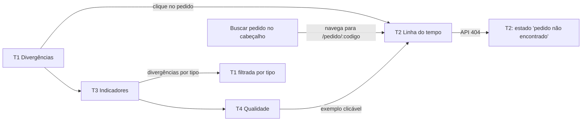

# POC_Lab — UX-SPEC

> Status: rascunho, Loop B rodada 2 — reabertura (2026-10-07). Base: `PRD-TECNICO.md`, `SDD.md` (ADR-013 a 016).
> Mudança desta rodada: o site deixa de ler JSON estáticos e passa a consumir a **API de leitura** (`/api/v1`). Mudam: paginação e filtro de T1 (agora no servidor), busca (resolvida pela API), estados de carregamento/erro (§4, com tabela de respostas da API) e restrições técnicas (§7). Telas, design system, acessibilidade e responsividade continuam os mesmos.
> Ajuste visual do `/definir` Loop C (2026-10-07): o usuário escolheu a direção visual **Modelo B — Painel de operações (escuro)**. Mudam a §3 (tokens, fontes, componentes visuais) e a §6 (menu lateral no PC, barra de abas no celular), com reflexos pequenos na §2 (cartões de resumo e chips na T1), §5 (contraste conferido) e §7 (fontes auto-hospedadas). Fluxos, estados e API não mudam.
> Persona das telas: analista de conciliação (fictícia). Público real: avaliador. Telas simples, legíveis, só leitura, em português (pt-BR). "Front elaborado" está fora do escopo.
> Complemento 2026-10-08 (achado ao comparar o entregue com o mockup aprovado "B · Divergências · PC"): a §3 ficou subespecificada em dois pontos — qual elemento usa qual item da escala tipográfica (título/rótulos) e o ritmo vertical entre blocos de página — e a implementação (`web/src/estilos/base.css`, `casca.css`) não preencheu a lacuna com um padrão equivalente. Mudam só trechos da §3 (tipografia e espaçamento); fluxos, cores e demais seções não mudam.
> Complemento 2026-10-08 (2ª rodada, causa raiz da divergência acima): o Frontend estava seguindo só o texto deste documento porque o mockup nunca tinha sido listado nele como referência obrigatória. Nova **§0** lista a URL do canvas e o artboard de cada tela; em aparência visual, o mockup passa a valer mais que o texto das §2/§3/§6 em caso de conflito.

## 0. Mockup aprovado (referência obrigatória de layout)

> Complemento 2026-10-08 (achado ao comparar o entregue com o mockup aprovado "B · Divergências · PC" — ver nota da §3): o Frontend vinha seguindo só o texto deste documento e perdeu detalhes visuais que só estão no mockup (ex.: caixa alta espaçada nos rótulos, ritmo vertical entre blocos). A partir desta rodada, **o mockup é fonte obrigatória de layout, junto com este documento — não opcional, não "referência de inspiração"**. Em caso de conflito entre o texto da §2/§3/§6 e o mockup, o mockup vence para aparência visual (cor, espaçamento, tipografia, disposição); este documento vence para comportamento, dados e acessibilidade (o mockup é estático).

**Canvas com todos os artboards:** `https://claude.ai/artifact/2pKjXUg3q3pCRBHJ1VjDsG`

Artboards aprovados (prefixo `B_`, Modelo B — Painel de operações escuro, escolhido em 2026-10-07). Os prefixos `A_` e `C_` no mesmo canvas são variantes **descartadas**: não usar como referência.

| Tela | Artboard PC | Artboard celular |
|---|---|---|
| T1 Divergências | `B_Divergencias_PC` | `B_Divergencias_Mobile` |
| T2 Linha do tempo do pedido | `B_LinhaDoTempo_PC` | `B_LinhaDoTempo_Mobile` |
| T3 Indicadores | `B_Indicadores_PC` | `B_Indicadores_Mobile` |
| T4 Qualidade dos dados | `B_Qualidade_PC` | `B_Qualidade_Mobile` |
| T5 Página não encontrada | `B_NaoEncontrada_PC` | — (mesmo layout, reflow) |

Antes de implementar ou revisar qualquer tela, o Frontend deve abrir o artboard correspondente no canvas acima e conferir: cor e contraste exatos, tipografia (fonte, peso, tamanho, caixa alta/baixa), espaçamento entre blocos, disposição dos componentes. Dúvida entre o artboard e o texto deste documento sobre aparência: perguntar antes de decidir por conta própria.

## 1. Fluxos de Tela

Navegação principal em todas as telas (menu lateral no PC, barra de abas no celular, §6): **Divergências** · **Indicadores** · **Qualidade** · **Como foi feito** (README no repositório) + campo **Buscar pedido**.

| Tela | Rota | Requisito | Rota da API | Prioridade |
|---|---|---|---|---|
| T1 Divergências (página inicial) | `/?tipo=&pagina=` | RF-07 | `GET /api/v1/divergencias` | M |
| T2 Linha do tempo do pedido | `/pedido/:codigo` | RF-05, RF-06 (S) | `GET /api/v1/pedidos/{codigo}/linha-do-tempo` | M (RF-06 = S) |
| T3 Indicadores | `/indicadores` | RF-08 | `GET /api/v1/indicadores` | M/S |
| T4 Qualidade dos dados | `/qualidade` | RF-04; sugestões da IA (RF-10, C) | `GET /api/v1/qualidade` | M (IA = C) |
| T5 Página não encontrada | qualquer outra | — | nenhuma | M |
| Cabeçalho (faixa de resumo) | todas | RF-11 | `GET /api/v1/resumo` | M |

O site é consumidor **v1** da API (ADR-016). A rota `/api/v2` não tem tela: é demonstrada no README com `curl`, e o fato de o site não mudar quando surgem eventos v2 é parte da demonstração do RF-09.

Jornada do avaliador (PRD-TECNICO §4): T1 → clique num pedido → T2 → T3 → T4.



Busca: aceita a identidade própria (`PED-000123`) ou o código de qualquer fonte; o campo apenas remove espaços nas pontas e navega para `/pedido/:codigo`; a API normaliza e resolve (código exato, ver §7). Campo vazio não navega e mostra "Informe um código" junto ao campo.

## 2. Wireframes

Baixa fidelidade: ordem e conteúdo. A disposição por largura (menu lateral, barra de abas, grade) está na §6 e a aparência na §3.

**Navegação e faixa de resumo (todas as telas)**
```
[Pular para o conteúdo]                          (visível só no foco)
POC_Lab — conciliação de pedidos
Buscar pedido: [__________________] [Buscar]
Divergências | Indicadores | Qualidade | Como foi feito ↗      (ícone + texto)
Dados sintéticos · corte AAAA-MM-DD · 16.282 pedidos              (de /api/v1/resumo)
```
Se `/api/v1/resumo` falhar, a faixa mostra só "Dados sintéticos" (sem números) e o resto da página segue; a falha não bloqueia a tela.

**T1 Divergências**
```
<h1> Divergências (N pedidos)
Cartões de resumo (de /api/v1/resumo, já carregado pela casca):
 [Com divergência 1.987 | 12,2% dos pedidos] [Valor em aberto R$ 45.678,90 | Σ devido − pago ...]
 [Pago a mais R$ 12.345,00 | Σ pago − devido ...] [Entregas no prazo 91,3% | 13.950 de 15.280]
Tipo (chips): (•) Todos · 1.987  ( ) Pago duas vezes · 120  ( ) Pagamento parcial · 210
              ( ) Pago e não enviado · 95  ( ) Enviado e não pago · 80  ( ) Entrega atrasada · 1.482
<table> caption: "Pedidos com divergência — filtro: Todos — página 1 de 40"
 Pedido      | Tipo                 | Motivo                                   | Eventos
 PED-000123  | [Pago duas vezes]    | Duas transações de R$ 410,00; devido ... | ▸ ver 3 eventos (details)
 ...
Página 1 de 40  [Anterior] [Próxima]          (50 por página)
```
"Pedido" é link para T2. "▸ ver eventos" abre `<details>` com os eventos que sustentam a divergência (tipo, data do fato, fonte, código). Filtro e página ficam na URL (`/?tipo=duplicado&pagina=2`): voltar do navegador e compartilhar o link funcionam. Trocar o filtro volta para a página 1. Cada troca de filtro ou de página faz uma nova chamada à API; a anterior, se ainda estiver em andamento, é cancelada.

Cartões de resumo: cada um mostra o valor e, em texto secundário, a base do cálculo (mesmo princípio dos indicadores: nada é só um número). Definições: **com divergência** = pedidos com ao menos uma divergência ÷ total de pedidos; **valor em aberto** = Σ (devido − pago) dos pedidos com "Pagamento parcial" ou "Enviado e não pago"; **pago a mais** = Σ (pago − devido) dos pedidos com "Pago duas vezes"; **entregas no prazo** = entregas com data ≤ data limite ÷ entregas com data conhecida (RN-06, total geral). Os números vêm de `totais` em `/api/v1/resumo`; se o resumo falhar, os cartões mostram "—" com "indisponível agora" e os chips ficam sem contagem, sem bloquear a tabela. Os chips são o mesmo grupo de rádio do filtro (só a aparência muda).

**T2 Linha do tempo do pedido**
```
<h1> Pedido PED-000123
Aparece em 3 de 3 fontes: vendas (10248) · pagamentos (TX-88812) · rastreio (RS-5521)
Valor devido R$ 440,00 · Pago R$ 880,00 · Data limite 1996-08-01
Situação: [Pago duas vezes]                   (divergências do pedido, se houver)

Ver estado em uma data: [ 1996-07-10 ] [Ver estado] [Limpar]      (RF-06, S)
→ "Em 1996-07-10: vendido, pago, ainda não coletado."

<ol> Linha do tempo (ordenada pelo momento do fato)
 1. 1996-07-04  Venda       fonte: vendas      #10248
 2. 1996-07-05  Pagamento   fonte: pagamentos  TX-88812  R$ 440,00
 3. 1996-07-05  Pagamento   fonte: pagamentos  TX-88813  R$ 440,00
 4. 1996-07-16  Coleta      fonte: rastreio    RS-5521   [chegou fora de ordem]
 ...
```
Uma única chamada à API traz cabeçalho e eventos. Se o usuário buscou por código de fonte, o `<h1>` mostra a identidade própria e uma linha "Encontrado pelo código TX-88812". O "estado em uma data" não chama a API: é calculado no navegador sobre os eventos já carregados. Com data informada, eventos posteriores ficam atenuados **e** marcados com o texto "depois da data escolhida". No PC a mesma `<ol>` é desenhada como grade com colunas por sistema (Data | Vendas | Pagamentos | Transportadora); no celular, como lista de cartões com a etiqueta da fonte (§3, §6).

**T3 Indicadores**
```
<h1> Indicadores
<h2> Entregas no prazo por transportadora e mês
  Fórmula: entregas com data ≤ data limite ÷ entregas com data conhecida
  <table> Transportadora | Mês | No prazo | Entregas | %
  Pedidos sem entrega (fora do denominador): 37
<h2> Divergências por tipo        <table> Tipo | Quantidade (link → T1 filtrada)
<h2> Tempo médio pedido→envio e envio→entrega   (S)  fórmula, soma, contagem, média
<h2> Valor pago × valor devido                   (S)  total e por situação, fórmula
```
Todo indicador mostra **fórmula, numerador e denominador** como texto, não só o percentual.

**T4 Qualidade dos dados**
```
<h1> Qualidade dos dados
Para cada tipo de achado (seção <h2>):
  Datas por formato · Pedidos sem envio · Valores fora do padrão · Linhas rejeitadas
  · Registros repetidos · Pagamentos sem identificação · Eventos fora de ordem
  Contagem: 830 (curto) / 15.452 (longo)
  Regra: "OrderDate em AAAA-MM-DD é 'curto'; com hora é 'longo'."
  Exemplos (até 10): <table> Fonte | Referência | Detalhe   (pedido → link T2)
<h2> Sugestões da IA (à parte, não entram nos indicadores)       (C)
  Pagamento | Texto da referência | Pedido sugerido | Conferida? | Motivo da regra
  — ou —  "IA não utilizada nesta publicação: pagamentos ficaram 'sem sugestão'."
```

**T5 Página não encontrada**: `<h1>` "Página não encontrada" + links para T1 e para a busca. Não chama a API.

## 3. Design System

Direção visual: **Modelo B — Painel de operações (escuro)**, escolhida pelo usuário em 2026-10-07 (referência obrigatória: artboards "B" do mockup aprovado, §0). Tema único escuro; alternância claro/escuro fica fora de propósito. Não há design system prévio: **todos os componentes abaixo são novos** (marcados `[novo]`). CSS puro, tokens em `web/src/estilos/tokens.css`; sem biblioteca de componentes nem de ícones.

**Cores** (contraste calculado pela fórmula de luminância relativa do WCAG 2.2; texto exige ≥ 4,5:1, componente de UI e foco ≥ 3:1):

| Token | Valor | Uso | Contraste |
|---|---|---|---|
| `--cor-fundo` | `#0e1217` | Fundo da página | — |
| `--cor-superficie` | `#151b22` | Cartões, tabelas, cabeçalho e barra de abas do celular | — |
| `--cor-lateral` | `#11161c` | Menu lateral | — |
| `--cor-borda` | `#263040` | Contorno de cartões e tabelas | Decorativa: não identifica controle |
| `--cor-divisoria` | `#1d2530` | Linha fina entre itens e linhas de tabela | Decorativa |
| `--cor-borda-controle` | `#6b7a89` | Contorno de campo de texto, campo de data, chip e botão secundário | 4,3:1 no fundo; 3,9:1 na superfície (≥ 3:1, WCAG 1.4.11) |
| `--cor-texto` | `#e6edf3` | Texto | 15,9:1 fundo; 14,7:1 superfície; 15,4:1 lateral |
| `--cor-texto-2` | `#a3b1bf` | Texto secundário, rótulos, fórmulas, base dos cartões | 8,6:1 fundo; 7,9:1 superfície; 8,3:1 lateral |
| `--cor-destaque` | `#2dd4bf` | Item de navegação ativo, chip selecionado, botão primário, contorno de foco | Como cor de UI: 10,1:1 fundo; 9,3:1 superfície |
| `--cor-sobre-destaque` | `#062420` | Texto sobre o destaque | 8,8:1 |
| `--cor-link` | `#7cc4ff` | Links (sublinhados no texto corrido) | 10,0:1 fundo; 9,2:1 superfície |
| `--cor-desabilitado` | `#6b7a89` | Texto de controle desabilitado | 4,3:1 fundo; 3,9:1 superfície. Abaixo de 4,5:1 de propósito: só em controle inativo (exceção do WCAG 1.4.3), nunca em texto informativo |

**Etiquetas de tipo** (`EtiquetaTipo`): sempre texto + fundo + borda; a cor nunca é o único indicador (o rótulo é o texto). A borda é decorativa.

| Tipo (`tipo` da API) | Rótulo | Texto / fundo / borda | Contraste do texto |
|---|---|---|---|
| `duplicado` | Pago duas vezes | `#ffa69b` / `#2a1414` / `#5c2626` | 9,2:1 |
| `parcial` | Pagamento parcial | `#f7c46c` / `#2a2010` / `#5a4318` | 10,0:1 |
| `pago_nao_enviado` | Pago e não enviado | `#cdb5ff` / `#1f1830` / `#42336b` | 9,5:1 |
| `enviado_nao_pago` | Enviado e não pago | `#9ccaff` / `#12203a` / `#26406e` | 9,5:1 |
| `entrega_atrasada` | Entrega atrasada | `#d0d7de` / `#1d242d` / `#39434f` | 10,8:1 |
| (sem divergência) | Sem divergência | `#86efac` / `#0f2417` / `#1f5133` | 11,6:1 |

Aliases de estado: `EstadoErro` usa a paleta de "Pago duas vezes" e `EstadoVazio`/sucesso a de "Sem divergência", sempre com texto ("Não foi possível…", "Nenhum…") e ícone `aria-hidden`.

**Foco:** contorno 3 px `--cor-destaque` com afastamento 2 px (≥ 9:1 contra fundo e superfície), em todo elemento focável.

**Tipografia** — **Manrope** para texto (pesos 400, 600, 700) e **JetBrains Mono** para códigos (pedido, transação, rastreio), datas, valores e contagens (400, 600). **Decisão: auto-hospedadas**, em `woff2` (fonte variável, subconjunto latino, que cobre o pt-BR) em `web/src/estilos/fontes/`, declaradas por `@font-face` no CSS (o Vite publica com nome versionado). Motivos: o CSP do site é `default-src 'self'` (SDD §7) e uma fonte de CDN externo exigiria afrouxá-lo; evita requisição a terceiro em cada visita; funciona sem rede no `pnpm dev`; não adiciona dependência npm (G-17). Custo zero: as duas fontes são de licença SIL OFL 1.1, e o texto da licença acompanha os arquivos e é citado no aviso de licença do repositório. `font-display: swap`; reserva: `system-ui, sans-serif` e `ui-monospace, monospace`. Base 16 px, altura de linha 1,5, escala 0,875 / 1 / 1,25 / 1,5 / 2 rem; números com `tabular-nums`.

**Mapeamento da escala para elementos (complemento 2026-10-08, Loop C — faltava no rascunho original e `web/src/estilos/base.css` não tinha regra própria para título/seções, caindo no padrão do navegador em vez da escala acima):**
| Elemento | Fonte/peso/tamanho | Observação |
|---|---|---|
| `<h1>` (título da página) | Manrope 700, `--texto-2xl` (2 rem), altura de linha 1,2 | Hoje sem regra própria em `base.css`: usa o padrão do navegador (que coincide em tamanho, mas não deve ficar implícito) |
| `<h2>` (seções de T3/T4) | Manrope 700, `--texto-xl` (1,5 rem), altura de linha 1,3 | Idem |
| Rótulo de cartão (`.cartao-resumo-titulo`), cabeçalho de tabela (`th`), legenda de chip/campo (`legend`), texto secundário em geral | Manrope 600, `--texto-sm`, **maiúsculas, `letter-spacing: 0.04em`** | Detalhe do artboard "B" aprovado ("labels em caixa alta espaçada") nunca registrado nesta rodada; aplica-se a todo uso de `--cor-texto-2` como rótulo (não ao texto corrido secundário, ex. base dos cartões, que permanece caixa normal) |
| Valor de cartão (`.cartao-resumo-valor`) | JetBrains Mono 600, `--texto-xl` | Já implementado conforme a escala |

**Espaçamento e forma:** 4 / 8 / 12 / 16 / 24 / 32 px; raio 6 px (cartões, campos, botões) e 999 px (chips, etiquetas); menu lateral 15 rem; conteúdo até 72 rem.

**Ritmo vertical entre blocos da página (complemento 2026-10-08 — mesma lacuna):** `base.css` zera a margem de `h1`/`p`/listas (reset global), e nenhuma regra devolve espaçamento entre os blocos de nível de página (título, cartões de resumo, chips de filtro, tabela/conteúdo principal) — hoje eles ficam colados uns nos outros. Regra: todo bloco de nível de página (direto dentro de `.casca__conteudo`) usa `--espaco-6` (32 px) de espaço vertical entre si — ex. `.casca__conteudo > * + * { margin-top: var(--espaco-6); }`, ou equivalente com `gap` se a página passar a usar um contêiner flex/grid vertical. Isso vale para T1 (h1 → `CartoesResumo` → `FiltroTipo` → tabela/paginação) e para o mesmo padrão nas demais telas.

**Ícones:** SVG próprios em linha (traço 1,5 px, 20 px), sempre `aria-hidden="true"` e ao lado de texto visível; nenhum controle é só ícone.

Componentes `[novo]`:
| Componente | Uso |
|---|---|
| `Casca` (disposição: menu lateral no PC; cabeçalho + barra de abas no celular, §6) | Todas |
| `LinkPularConteudo`, `CampoBusca`, `FaixaResumo` ("Dados sintéticos · corte · total") | Todas |
| `NavegacaoPrincipal` (um único `<nav>`; ícone + texto; item ativo com `aria-current="page"`, fundo superfície, barra de 3 px `--cor-destaque` e texto em peso 600, não só cor) | Todas |
| `EstadoCarregando`, `EstadoVazio`, `EstadoErro` (com "Tentar de novo") | Todas (§4) |
| `CartoesResumo` (4 cartões: valor em mono 1,5 rem + base em texto secundário; sem resumo: "—" e "indisponível agora") | T1 |
| `FiltroTipo` em **chips** (grupo de rádio nativo em `<fieldset>`; rótulo + contagem "Pago duas vezes · 120"; selecionado: preenchido `--cor-destaque`, texto `--cor-sobre-destaque` e marca ✓; não selecionado: superfície + `--cor-borda-controle`; quebra de linha, sem rolagem horizontal) | T1 |
| `TabelaDados` (`<caption>`, `<th scope>`, contêiner rolável rotulado; cabeçalho em texto secundário; linhas com divisória; códigos em mono; valores alinhados à direita) | T1, T3, T4 |
| `EtiquetaTipo` (6 variantes da tabela acima) | T1, T2, T4 |
| `EtiquetaFonte` (Vendas · Pagamentos · Transportadora; sem preenchimento, texto secundário, contorno `--cor-borda`) | T2 |
| `Paginacao` (recebe `pagina`, `totalPaginas` da API; links com `?pagina=`) | T1 |
| `LinhaDoTempo` (uma única `<ol>`; PC: grade Data \| Vendas \| Pagamentos \| Transportadora — data em mono na 1ª coluna e o cartão do evento na coluna da sua fonte; títulos das colunas são visuais, `aria-hidden`, e cada item traz a fonte em texto; celular: cartões com data, `EtiquetaFonte`, tipo, código e valor) | T2 |
| `SeletorData` (`<input type="date">` + botões) | T2 (RF-06) |
| `Indicador` (título, fórmula, numerador, denominador, resultado) | T3 |
| `BlocoAchado` (contagem, regra, exemplos) | T4 |

Rótulos das fontes na interface (coluna, etiqueta e texto "fonte: …"): `vendas` → "Vendas", `pagamentos` → "Pagamentos", `rastreio` → "Transportadora". Os wireframes da §2 usam os nomes técnicos; a API e o README também.

Não-visual `[novo]`: `clienteApi` + gancho `useConsulta` (fetch, cancelamento, tempo limite, validação zod, tradução de erro RFC 9457 em estado de tela). Nenhuma biblioteca de dados (TanStack Query fica de fora, ADR-014).

Formatação: datas `AAAA-MM-DD` (são datas da base, sem fuso), moeda `R$ 1.234,56` via `Intl.NumberFormat('pt-BR')`.

## 4. Estados de Tela

| Tela | Carregando | Vazio | Erro | Sucesso |
|---|---|---|---|---|
| T1 | "Carregando divergências…" (`aria-busy` na tabela, região `aria-live="polite"`). Filtro e paginação continuam visíveis; botões de paginação desabilitados durante a chamada | Filtro sem itens: "Nenhum pedido com divergência do tipo X." Página além da última (API devolve lista vazia com o total): "Esta página não existe. [Ir para a página 1]" | Mensagem conforme a tabela abaixo + Tentar de novo (repete a mesma chamada) | Tabela paginada; total no `<h1>`; `<caption>` com filtro e página; contagem anunciada |
| T2 | "Buscando pedido…" | API 404 `pedido_nao_encontrado` ou 400 `parametro_invalido` no código: **"Pedido não encontrado"** + dica dos formatos aceitos (sem erro técnico, RF-05). Data anterior à venda: "Nenhum evento até esta data." | Demais falhas: mensagem + Tentar de novo | Cabeçalho do pedido + linha do tempo |
| T3 | "Carregando indicadores…" | Indicador sem denominador (0 entregas): "sem entregas com data conhecida" em vez de 0% | Mensagem + Tentar de novo | Tabelas com fórmula/numerador/denominador |
| T4 | "Carregando relatório…" | Tipo de achado com contagem 0: mostra a regra e "Nenhum caso encontrado." IA ausente: mensagem própria (§2) | Mensagem + Tentar de novo | Blocos por tipo |
| T5 | Não se aplica: não chama a API | Não se aplica: a página é o próprio estado de "vazio" de rota | Não se aplica: não lê dados | Mensagem + links |
| Cabeçalho | Faixa mostra "Dados sintéticos" até chegar o resumo (sem anúncio, para não poluir o leitor de tela) | Não se aplica | Faixa fica só com "Dados sintéticos"; sem mensagem de erro (informação acessória) | Data de corte e total de pedidos |

**Respostas da API → estado de tela** (regra única no `clienteApi`):

| Situação | Estado | Mensagem ao usuário |
|---|---|---|
| 200 com corpo válido no esquema zod | Sucesso ou Vazio | — |
| 200 com corpo fora do esquema, ou resposta que não seja JSON | Erro | "Os dados recebidos estão em formato inesperado." + Tentar de novo |
| 400 `parametro_invalido` em T1 (ex.: `?tipo=` ou `?pagina=` inválidos na URL) | Vazio corrigível | "O filtro do endereço não é válido. [Ver todas as divergências]" |
| 400 / 404 em T2 | Vazio | "Pedido não encontrado" + formatos aceitos |
| 5xx (inclusive D1 indisponível ou republicação em andamento) | Erro | "Não foi possível consultar os dados agora. Tente de novo em alguns segundos." + Tentar de novo |
| Falha de rede | Erro | "Sem conexão com o servidor." + Tentar de novo |
| Sem resposta em 10 s (chamada cancelada) | Erro | "A consulta demorou demais." + Tentar de novo |
| Chamada cancelada pelo próprio site (troca de filtro/página/rota) | Nenhum | Silencioso; vale só a resposta da chamada mais recente |

Nunca exibir `detail`, `type`, código HTTP ou texto técnico da API ao usuário; o `codigo` do erro só decide o estado. "Tentar de novo" leva o foco de volta para a região do conteúdo e reanuncia "Carregando…".

## 5. Acessibilidade

Meta: **WCAG 2.2 nível AA**, não negociável. Verificação automatizada: `vitest-axe` em cada tela/componente (sem violação crítica ou séria), incluindo os estados de carregamento, vazio e erro.

Revisão por tela (`accessibility-review`), sem pendência crítica:
- **Global:** `<html lang="pt-BR">`; `<title>` único por rota ("Divergências — POC_Lab"; na T1 inclui a página: "Divergências, página 2 — POC_Lab"); link "Pular para o conteúdo"; *landmarks* `header`/`nav`/`main`; ao trocar de rota, o foco vai para o `<h1>` (`tabIndex=-1`); foco sempre visível (contorno 3 px, contraste ≥ 3:1); tudo operável por teclado; nada depende só de cor; respeita `prefers-reduced-motion` (não há animação relevante).
- **Carregamento e erro (API):** região `aria-live="polite"` única por tela anuncia "Carregando…", o resultado ("50 de 1.987 divergências, página 2 de 40") e os erros; `aria-busy="true"` na região durante a chamada; o erro tem `role="alert"` só quando interrompe a tela (não na faixa do cabeçalho).
- **Busca:** `<label>` visível, `<form role="search">`; "Informe um código" associado ao campo por `aria-describedby`; "não encontrado" anunciado pela região `aria-live` da T2.
- **T1:** filtro em `<fieldset>`/`<legend>`; mudança de filtro ou de página atualiza o `<caption>` e anuncia a contagem; paginação com `aria-label="Paginação"`, página atual em `aria-current="page"`; ao trocar de página, o foco vai para o `<caption>` da tabela (não volta ao topo da página); botões desabilitados durante a carga usam `aria-disabled` e continuam focáveis; `<details>/<summary>` nativo para os eventos.
- **T2:** linha do tempo em `<ol>`; data e fonte em texto; "chegou fora de ordem" e "depois da data escolhida" em texto, não só estilo; `<input type="date">` com `<label>`.
- **T3/T4:** tabelas com `<caption>` e `<th scope>`; fórmulas em texto; contêiner rolável com `tabIndex=0`, `role="region"` e `aria-label`.
- **Contraste (Modelo B):** pares da §3 calculados: texto ≥ 7,9:1 em todo par usado (mínimo exigido 4,5:1); contorno de controle, chip e foco ≥ 3:1; bordas de 1,4:1 são só decorativas (cartão, tabela, etiqueta) e nunca a única forma de identificar um controle; cor de desabilitado só em controle inativo. Teste automatizado de contraste dos pares de tokens (além do axe, que não calcula contraste no jsdom).
- **Navegação (Modelo B):** item ativo com `aria-current="page"` e indicação por barra e peso, não só cor; chip selecionado indicado por preenchimento e ✓; ícones `aria-hidden` sempre com texto; a barra de abas fixa do celular nunca encobre o elemento com foco (WCAG 2.4.11: `scroll-padding-bottom` com a altura da barra).

Pendências: nenhuma crítica. Não há verificação com leitor de tela real hoje (prazo); fica registrado como fora de propósito.

## 6. Comportamento Responsivo

Mobile-first; pontos de quebra 640 px e 1024 px. Duas disposições (Modelo B):

```
PC (≥ 1024 px)                                   Celular (< 1024 px)
┌───────────────┬──────────────────────────┐     ┌──────────────────────────┐
│ POC_Lab       │ <h1> Divergências        │     │ POC_Lab                  │
│ [Buscar…    ] │ [card][card][card][card] │     │ [Buscar pedido…        ] │
│ ▣ Divergências│ (chips do filtro)        │     │ Dados sintéticos · corte │
│ ▣ Indicadores │ ┌ tabela ──────────────┐ │     ├──────────────────────────┤
│ ▣ Qualidade   │ │                      │ │     │ [card][card]             │
│ ↗ Como foi    │ └──────────────────────┘ │     │ [card][card]             │
│               │                          │     │ (chips com quebra)       │
│ Dados sintét. │                          │     │ tabela rolável           │
│ · corte·total │                          │     ├──────────────────────────┤
└───────────────┴──────────────────────────┘     │ Diverg│Indic│Qualid│Como │  (abas fixas)
                                                  └──────────────────────────┘
```

- **≥ 1024 px (PC):** menu lateral à esquerda (15 rem, `--cor-lateral`, `position: sticky`, altura da janela, rola por conta própria) com logo, busca, navegação com ícones e, embaixo, a faixa "Dados sintéticos · corte · total"; conteúdo à direita, até 72 rem. Cartões de resumo em 4 colunas. Linha do tempo em grade de 4 colunas (Data | Vendas | Pagamentos | Transportadora).
- **< 1024 px (tablet e celular):** cabeçalho no topo (não fixo) com logo e busca em largura total; faixa de resumo em uma linha abaixo dele; **barra de abas inferior fixa** (`--cor-superficie`, altura 56 px) com 4 itens com ícone + rótulo: Divergências, Indicadores, Qualidade, Como foi feito ↗ (este abre o repositório; rótulo acessível "Como foi feito (abre o repositório)"). O conteúdo tem `padding-bottom` e `scroll-padding-bottom` iguais à altura da barra. Cartões de resumo em 2×2 (em 4 colunas a partir de 640 px se couberem). Linha do tempo em lista de cartões com `EtiquetaFonte`. Tabelas em contêiner com rolagem horizontal rotulada. Chips quebram linha.
- **Altura da janela < 480 px** (celular deitado ou zoom alto): a barra de abas deixa de ser fixa e vai para o fim da página, para não cobrir o conteúdo.
- **< 640 px:** paginação mostra "Página N de M" + Anterior/Próxima (sem lista de números).
- **Um único `<nav>` no DOM** (a CSS o posiciona no menu lateral ou na barra de abas). Ordem de foco nas duas disposições: Pular para o conteúdo → busca → navegação → conteúdo. No celular a navegação fica embaixo na tela e antes do conteúdo no foco; o link "Pular para o conteúdo" resolve o atalho. A faixa de resumo não é focável, então mudar sua posição visual não afeta a ordem de foco.
- Alvos de toque ≥ 24×24 px (WCAG 2.5.8); abas e chips com ≥ 44 px de altura. Zoom de 200% sem perda de conteúdo; reflow a 320 px de largura (chips e cartões quebram linha; só tabelas rolam na horizontal).
- Estados de carregamento/erro ocupam a mesma área do conteúdo (sem salto de layout no menu ou no cabeçalho).
- T5: não aplicável além do layout base.

## 7. Restrições Técnicas Aplicadas

Autochecagem contra o `SDD.md` (mesmo agente). Todas são trade-offs de detalhe, dentro do aprovado; nenhum muda custo ou prazo além do já sinalizado no SDD §6.

| Restrição do SDD | Efeito na experiência | Decisão |
|---|---|---|
| API somente leitura, busca por código exato (ADR-013, ADR-016) | Sem busca parcial nem sugestão enquanto digita | Busca por código exato; dica dos formatos aceitos no "não encontrado" |
| Paginação por página no servidor, `tamanho` ≤ 100 (ADR-016) | Cada página é uma chamada; não dá para rolar tudo | 50 por página, "Página N de M", filtro e página na URL; sem rolagem infinita |
| Requisições ao Worker são o único custo variável (SDD §6) | Evitar chamadas desnecessárias | Sem busca enquanto digita, sem *polling*, sem pré-carregar páginas; cancela chamada obsoleta |
| Republicação recria as tabelas (janela de erro) | A API pode responder 5xx por alguns segundos | Mensagem "Tente de novo em alguns segundos" + botão |
| RF-06 sem rota na API | Estado em uma data calculado no cliente | Função pura do `dominio` sobre os eventos já carregados; sem nova chamada |
| Site é consumidor v1 (ADR-016) | `meio_pagamento` (v2) não aparece na tela | Mantido de propósito: demonstra que o consumidor v1 não muda; v2 mostrado no README |
| IA só no processamento (ADR-010) | Visitante não pode pedir sugestão | Sugestões pré-calculadas, exibidas à parte em T4; sem botão "pedir sugestão" |
| SPA com *fallback* para `index.html`; só `/api/*` chega ao Worker | Rota inexistente do site não gera 404 do servidor | T5 tratada pelo roteador; resposta não JSON em `/api` tratada como erro (§4) |
| Front elaborado fora do escopo (PRD §4) | Sem gráficos | Indicadores em tabela, com fórmula. O Modelo B muda só a aparência (tokens, fontes, disposição), não os fluxos |
| CSP `default-src 'self'` nos assets (SDD §7) e nenhuma dependência fora do SDD §3 (G-17) | Fonte de CDN externo seria bloqueada; pacote de fontes ou de ícones seria dependência nova | Fontes auto-hospedadas em `woff2` no repositório (licença OFL citada no aviso de licença); ícones SVG próprios; CSP e dependências não mudam |
| API v1 sem rota nova (ADR-016) | Cartões de resumo e contagem dos chips da T1 precisam de números agregados | Vêm de `totais` em `GET /api/v1/resumo` (o "Totais" já previsto no SDD §2), carregado uma vez pela casca e compartilhado; nenhuma chamada a mais por tela |
